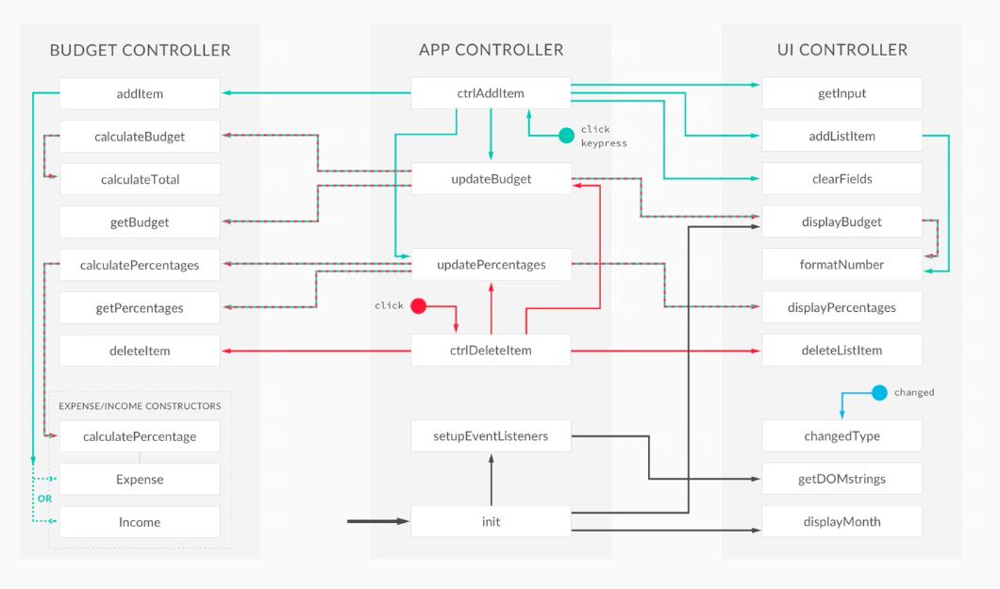
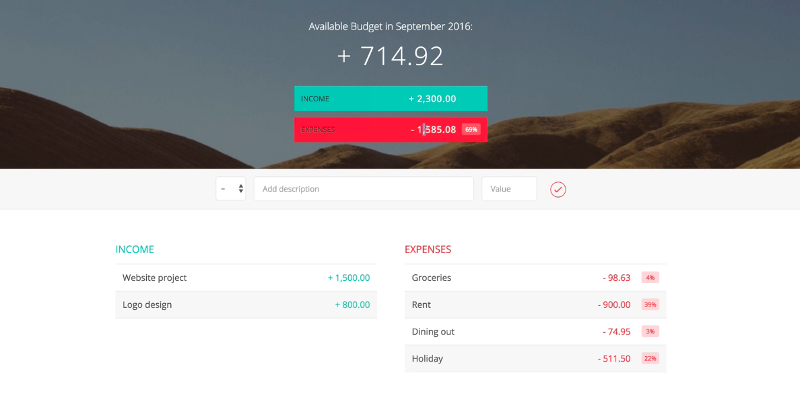

# The Budget App

This is a simple budget app build using HTML, CSS, and JavaScript.

The primary logic behind this application is through JavaScript.

## Design:

## Planning:

### UI Module
* Get input values
* Add the new item to the UI
* Update the UI

### Data Module
* Add the new item to the data structure
* calculate budget

### Controller Module
* Add event handler 

## Execution:
I built this step by step over a few weeks using protypes and various references from the web, cited in the project to aid my code and project.

## JavaScript concepts used:
* Module pattern
* Data encapsulation 
* Separation of concerns 
* Event listeners 
* Data structures/ passing data from one structure to another 
* DOM manipulation using insertAdjacentHTML 
* Loops 
* Convert field inputs into numbers
* Event delegation
* String manipulation 

## Final Product:

